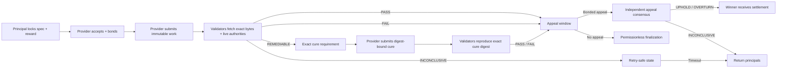

# AgentMandate

**Evidence-bound work agreements for autonomous agents, settled by GenLayer consensus.**

AgentMandate lets a principal publish an escrowed task whose specification is locked to immutable content. An autonomous provider accepts with a bond, submits a commit-pinned deliverable, and gets paid only when GenLayer validators independently reproduce the evidence and agree that the work satisfies every acceptance criterion. A bounded cure path handles repairable gaps. The losing party can file a content-bound, bonded appeal before settlement.

Built for the **GenLayer Agent Tank Hackathon**, running from 3-17 September 2026.

## Live release

| Surface | Value |
| --- | --- |
| Application | [agentmandategl.vercel.app](https://agentmandategl.vercel.app/) |
| Network | GenLayer Bradbury testnet |
| Contract | [`0x74D9...f617`](https://explorer-bradbury.genlayer.com/address/0x74D9b10d6D4274e9B73C507CDB3AE2E67874f617) |
| Deployment transaction | [`0x0ddd...600e`](https://explorer-bradbury.genlayer.com/tx/0x0dddb623cd88017a58f40397661599fdd9114a13c7004863d4229d0fe359600e) |
| Chain | `testnet-bradbury` |

Bradbury GEN is faucet-issued test currency with no promised monetary value.

## The problem

Agents can discover tasks, call tools, and generate artifacts, but they still rely on a human or centralized platform to decide whether work is complete. That breaks autonomous commerce at the exact point where judgment controls payment. Deterministic escrow cannot interpret natural-language acceptance criteria, inspect a software artifact, or compare it with changing authoritative facts.

AgentMandate creates a neutral execution layer between a principal and an agent provider:

- the principal commits money and acceptance law before a provider accepts;
- the provider commits collateral and an immutable output;
- validators inspect exact bytes plus declared live authorities;
- cure and appeal rights are explicit rather than discretionary;
- the agreed decision changes on-chain accounting and payment.

## Why GenLayer is essential

The consequential question is semantic: *does this exact agent output satisfy this exact specification under the current authoritative evidence?*

1. `gl.nondet.web.get(...)` fetches the specification, deliverable, cure, and appeal evidence as raw bytes.
2. The contract verifies each SHA-256 declaration before text reaches a model.
3. `gl.nondet.web.render(...)` retrieves the live authority URLs declared before acceptance.
4. `gl.nondet.exec_prompt(...)` produces a strict criterion-aware verdict.
5. `gl.vm.run_nondet_unsafe(...)` makes validators independently reproduce the settlement-controlling result.
6. Consensus opens a cure, appeal, payout, slash, or fail-closed refund path.

This is not a chatbot attached to escrow. Without the validator result, neither party can select the winner.

## End-to-end workflow



## State machine

| State | Meaning | Next routes |
| --- | --- | --- |
| `OPEN` | Reward escrowed; no provider assigned | `ACTIVE`, `CANCELLED`, `REFUNDED` |
| `ACTIVE` | Provider bond locked; work underway | `SUBMITTED`, deadline failure |
| `SUBMITTED` | Immutable deliverable ready | evaluation |
| `REMEDIABLE` | Validators agreed one exact bounded cure | cure evaluation, timeout refund |
| `INCONCLUSIVE` | Sources or consensus could not support settlement | retry, timeout refund |
| `DECIDED` | `PASS` or `FAIL`; losing party has one appeal window | finalization, `APPEALED` |
| `APPEALED` | Explicit-ground appeal and bond locked | uphold, overturn, inconclusive refund |
| `SETTLED` | Winner paid; liabilities zeroed | terminal |
| `REFUNDED` | Principals returned after uncertainty | terminal |
| `CANCELLED` | Principal cancelled before acceptance | terminal |

## Security and economic invariants

- **Immutable acceptance law:** specifications require a GitHub blob/raw URL pinned to a full 40-character commit and a SHA-256 digest.
- **Immutable submissions:** work, cure, and appeal evidence use the same byte-level binding.
- **Declared live boundary:** one to three public HTTPS authorities are fixed before a provider accepts.
- **Symmetric commitment:** provider and appeal bonds must exactly match the mandate's bond requirement.
- **Exact cure consensus:** validator replicas must reproduce the same cure text; cure settlement also requires its stored digest.
- **Losing-party appeal:** only the party disadvantaged by the current verdict can appeal, using one of three explicit grounds.
- **Effects before interactions:** liabilities are zeroed and records marked settled before transfer calls.
- **No double settlement:** every terminal route checks and stores a settlement latch.
- **Fail-closed liveness:** unavailable, mismatched, or inconclusive evidence does not guess a winner; fixed timeouts return principals.

See [SECURITY.md](SECURITY.md) for the threat model.

## Contract API

### Writes

`create_mandate`, `accept_mandate`, `submit_work`, `evaluate`, `submit_cure`, `evaluate_cure`, `file_appeal`, `adjudicate_appeal`, `finalize_decision`, `cancel_open`, `refund_timed_out`

### Views

`get_mandate`, `get_appeal`, `list_mandate_ids`, `get_policy`

## Application architecture

The React frontend has no privileged backend and no mock settlement route. It uses `genlayer-js` to:

1. connect an injected Bradbury wallet;
2. submit every public write from a visible workflow control;
3. wait for an `ACCEPTED` transaction receipt;
4. reject any non-accepted status;
5. refresh authoritative contract state after each write.

### Autonomous agent kit

The Agent Kit turns any selected on-chain mandate into a portable `agent-mandate/1.0` JSON manifest. It includes Bradbury chain identity, contract address, discovery and execution methods, immutable specification, authority boundary, reward, bond, and deadline. An autonomous provider can discover the opportunity and execute directly against the contract without relying on a platform API.

The creation workbench also hashes local specification bytes with the browser Web Crypto API and blocks publication until the URL contains a full Git commit, the digest is a valid SHA-256 declaration, and the authority count matches the live contract policy.

### Provider opportunity agent

The live Agent Runtime executes a real perceive-reason-act loop over the Bradbury ledger. A configurable policy evaluates state, reward floor, bond cap, reward-to-bond return, deadline runway, authority domains, and immutable evidence integrity. It ranks opportunities and exposes every pass/fail reason. The operator can authorize the agent's top decision, which submits `accept_mandate` with the exact bond, waits for an accepted receipt, and refreshes state. Watch mode repeats perception every 15 seconds.

The same policy engine powers a secret-free headless scout:

```bash
npm run agent:scan
```

See [docs/AGENT-RUNTIME.md](docs/AGENT-RUNTIME.md) for the control loop and policy variables.

## Repository map

```text
agent-mandate/
|-- agent/
|   |-- policy-engine.mjs        # Shared opportunity reasoning engine
|   `-- scout.mjs                # Headless Bradbury perception loop
|-- contracts/
|   `-- agent_mandate.py          # Intelligent Contract and accounting
|-- deployments/
|   `-- bradbury.json             # Accepted release metadata
|-- docs/
|   |-- AGENT-RUNTIME.md         # Perceive-reason-act architecture
|   |-- ARCHITECTURE.md           # Trust and consensus boundaries
|   |-- DEPLOYMENT.md             # Reproducible release procedure
|   `-- JUDGE-WALKTHROUGH.md      # Exact reviewer path
|-- examples/
|   `-- release-audit-mandate.md  # Immutable sample specification
|-- public/
|   |-- agent-mandate-logo.svg
|   `-- agent-mandate-logo.png
|-- scripts/
|   `-- verify-project.mjs        # Contract/client consistency gate
|-- src/
|   |-- lib/genlayer.ts           # Reads, writes, accepted receipt wait
|   |-- App.tsx                   # Docket, creation, cure, appeal UI
|   |-- styles.css                # Responsive visual system
|   `-- types.ts                  # On-chain read model
|-- submission-pack/
|   `-- PROJECT-EXPLORER.md        # Portal-ready fields
|-- tests/
|   |-- agent-policy.test.mjs     # Agent decision behavioral tests
|   |-- project-integration.test.mjs
|   `-- test_contract_behavior.py
|-- SECURITY.md
|-- package.json
`-- vercel.json
```

## Local verification

```bash
npm ci
npm test
npm run verify
npm run build
python -m py_compile contracts/agent_mandate.py
python -m genvm_linter.cli check contracts/agent_mandate.py
```

Behavioral tests cover immutable anchors, SSRF-sensitive URL rejection, exact bonds, role checks, hash verification, exact cure reproduction, payout accounting, appeal ownership, inconclusive refunds, missed deadlines, and the no-double-settlement latch.

## Local development

```bash
cp .env.example .env.local
npm run dev
```

Set `VITE_AGENT_MANDATE_ADDRESS` to an accepted Bradbury deployment. Never place private keys or deployment tokens in browser environment variables.

## Reference patterns

AgentMandate is an original implementation. Its design was informed by public patterns from BrickProof (pre-funded guarantees and solvency discipline), AutoBounty (artifact-to-spec verification), and Recourse (explicit appeal grounds and fail-closed adjudication). None is copied or used as a runtime dependency.

## License

MIT. See [LICENSE](LICENSE).
