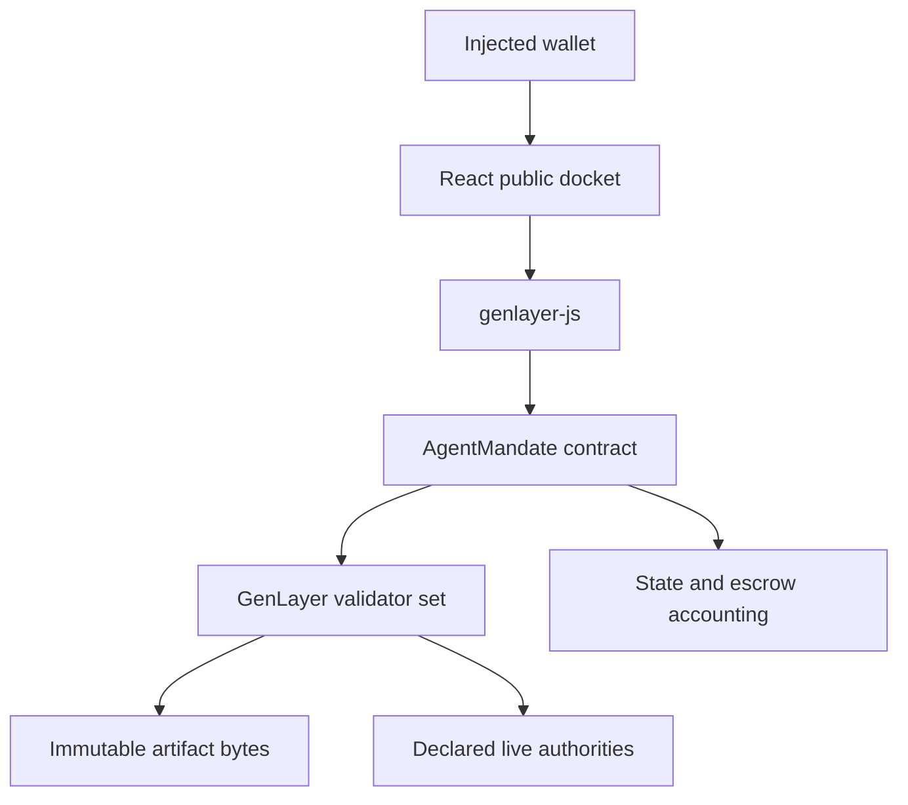

# Architecture

## Components

## Evidence model

The principal's specification and every party-produced artifact are `URL + sha256` pairs. URLs only accept canonical GitHub blob/raw paths containing a full commit. Validators use `web.get`, hash raw bytes, enforce a 32 KB ceiling, and decode only after the observed digest matches.

Live authority URLs are different by design: they represent changing world state and are rendered during each validator run. They are declared while the mandate is created and cannot be replaced after a provider accepts.

## Consensus fields

Initial evaluation replicas must agree on verdict, criterion counts, and the exact cure requirement. Free-form reasoning can differ but must be non-empty and bounded. A passing verdict is invalid unless every reported criterion is met.

Cure evaluation includes `sha256(exact cure requirement)` in the strict output. Both leader and validators must reproduce that stored digest before `PASS` or `FAIL` can open settlement.

Appeals use one explicit ground and immutable appellant evidence. Replicas agree on `UPHOLD`, `OVERTURN`, or `INCONCLUSIVE`.

## Accounting

The principal reward and provider bond are the complete base liability. An appeal adds exactly one appeal bond. Every terminal route computes recipients, zeros all liabilities, marks records settled, saves state, then transfers. Inconclusive appeal and timeout paths return each principal rather than selecting a winner.

